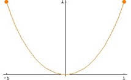
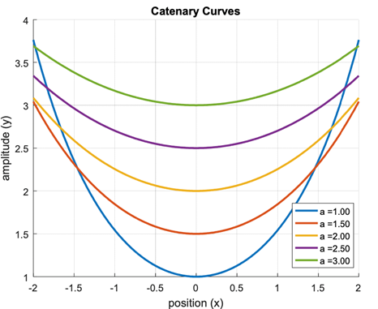

# Catenary Curves

## Free Hanging Cable

A free hanging cable suspended from two fixed points takes the shape of a catenary curve (see below).

The equation of a catenary curve is :

where is defined as :

Write a Python program which will calculate the value of from first principles (i.e. do _ **not** _ use a built in function! However, you may use the factorial function).

Your code should :

- Ask the user for the required level of precision.
- Stop the calculation when that level is reached.(i.e. when the difference between the _n_th term and the (_n_-1)th term is less than the required precision).

Once you have confirmed your code is giving you the correct answer, change it so that it will now plot a series of catenary curves for various values of _a_ across a fixed range of _x_.

Your code should :

- Ask the user for a starting point, an end point and an increment for _x_.
- Ask the user for a starting point, an end point and an increment for _a_.
- Check to make sure you have valid entries for _a_ (e.g. _a__min_ \&gt; 0, etc.).
- Display a graph with appropriate labels for the axes, title and curves (see below).

## A sample figure screen :

